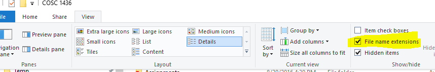

= Setting Up Windows
Michael Taylor <michael.taylor@tccd.edu>
v1.0
:toc:

Windows is designed for a novice user. Programming is considered an advanced scenario and therefore the default Windows settings and programs are not ideal. The following are recommended changes you make to your computer to simplify your programming efforts.

== Show File Extensions

Out of the box Windows does not show the file extension.
Most files have a file extension that help identify the type of file but users are generally not concerned with this. 
Showing the file extensions helps avoid accidentally changing the wrong files.

. Open `Windows Explorer` (not Internet Explorer).
. For Windows 11
.. Go to the `View` option in the ribbon bar.
.. Go to `Show \ File name extensions` in the menu.
. For Windows 10
.. Go to the `View` tab in the ribbon bar.
.. Check the option `File name extensions`
+

. For older Windows versions
.. Press the Alt key to bring up the menu for Explorer and select `Tools \ Options`
.. Go to the `View` tab.
... Uncheck the option `Hide file extensions for known file types`.

All files shown in Windows Explorer will now show the (generally 3 letter) file extension after the file name (ex. Explorer.exe).

== Blocked Files

Windows is designed to be secure by default.
When downloading a file from the Internet Windows may mark the file as blocked. This is to protect you from running dangerous files.
In general, trying to access a blocked file will fail.
To check whether a file is blocked or not do the following.

. Open `Windows Explorer` and locate the file.
. Right click the file and select `Properties`.
. On the `General` tab, if the file is blocked you will see a message about it being blocked and an option to unblock it. 
+
image:unblock.png[Unblock]
. Click the option to unblock the file.

== See Also

link:/setup/github/readme.adoc[Setting Up Github]
link:/setup/visualstudio/readme.adoc[Setting Up Visual Studio]
